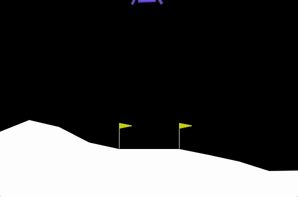
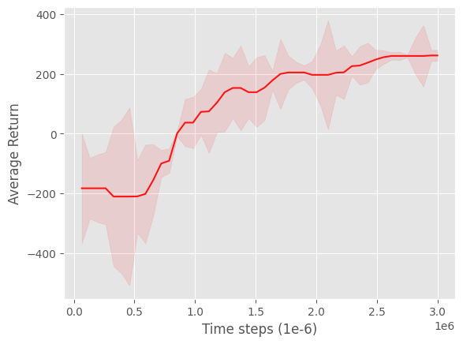
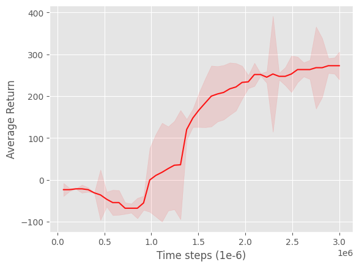
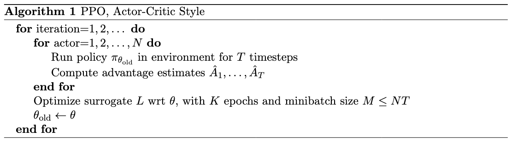
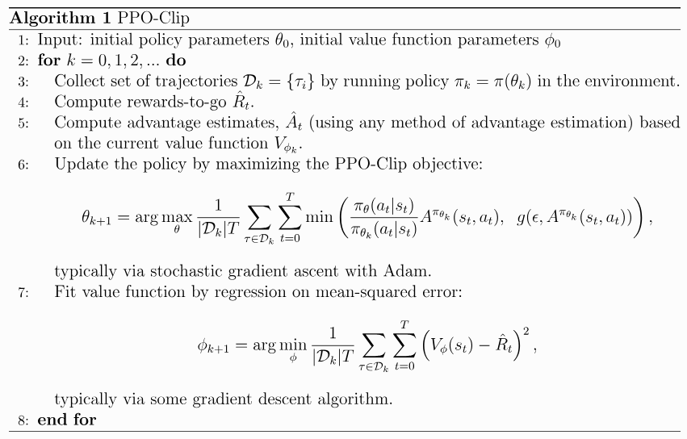
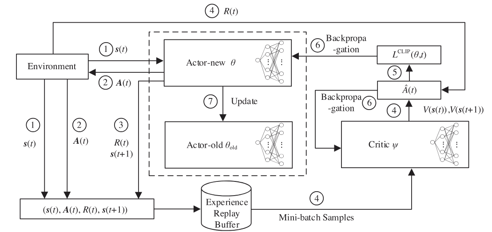

# Proximal Policy Optimization

PyTorch implementation of [Proximal Policy Optimization](https://arxiv.org/abs/1707.06347) introduced from Schulman et al., 2017.

| | |
| -- | -- |
|  |  |
|  |  |

Figures: Learning curves for the three OpenAI Gym (Box2D) control tasks:  

* LunarLander-v3 (proprioceptive states, discrete action space)

* BipedalWalker-v3 (proprioceptive states, continuous action space)

* CarRacing-v3 (visual states, continuous action space)

The shaded region represents the standard deviation of the average evaluation over 2 trials (across 2 different seeds). Curves are smoothed with an average filter.

*Note: This repository implements PPO for discrete and continuous action spaces. It also supports parallelization.*

## Algorithm

### Quick Facts

* PPO is a model-free algorithm
* PPO is an on-policy algorithm
* PPO can be used in discrete and continuous action spaces

| | |
| ----------------------- | ---------------- |
|  |  |
| *PPO algorithm. Taken from [Schulman et al., 2017](https://arxiv.org/abs/1707.06347).* |   *PPO-Clip algorithm. Taken from [OpenAI Spinning Up](https://spinningup.openai.com/en/latest/algorithms/ppo.html).* |

| |
| --------------- |
|  |
| *PPO diagram. Taken from [Tan et al., 2023](https://ietresearch.onlinelibrary.wiley.com/doi/10.1049/cmu2.12710).* |

## Usage

To train on an env of choice just run:

```bash
python3 main.py --env_id=LunarLander-v3
```

Or:

```python
import gymnasium as gym
from ppo import PPO, ActorCriticDiscreteMLP

env = make_env("LunarLander-v3")

actor_critic = ActorCriticDiscreteMLP(
    state_dim=env.observation_space.shape[0],
    action_dim=env.action_space.n,
    h1_dim=256,
    h2_dim=256,
)

ppo = PPO(
    actor_critic=actor_critic,
    n_envs=32,
    learning_rate=0.0003,
    time_steps=1_000_000,
    horizon=2048,
    batch_size=8 * 32,
    n_epochs=3,
    gamma=0.99,
    gae_lambda=0.95,
    clip_range=0.1,
    clip_grad_norm=0.5,
    entropy_coef=0.0001,
    vf_coef=0.5,
    device="cpu", # or "cuda"
)
```

## Experimental setup

* OS: Fedora Linux 42 (Workstation Edition) x86_64
* CPU: AMD Ryzen 5 2600X (12) @ 3.60 GHz
* GPU: NVIDIA GeForce RTX 3060 ti (8GB VRAM)
* RAM: 32 GB DDR4 3200 MHz

All experiments (LunarLander-v3, BipedalWalker-v3 and CarRacer-v3) shared the following hyperparameters:

| Hyperparameter | Value |
| -------------- | ----- |
| n_envs | 32 |
| learning_rate | 0.0003 |
| time_steps | 1e-6 |
| horizon | 2048 |
| n_epochs | 4 |
| gamma | 0.99 |
| GAE lambda | 0.95 |
| clip_range | 0.2 |
| clip_grad_norm | 0.5 |
| entropy_coef | 0.001 |
| vf_coef | 0.5 |

LunarLander-v3 used 1e6 timesteps, Bipdealwalker-v3 used 3e-6 timesteps and CarRacing-v3 used 5e-6 timesteps and 8 envs.

| Environment | Average Return |
| --  | -- | 
| LunarLander-v3 |  261.31 ± 18.20 |
| BipedalWalker-v3 | 272.79  ± 33.25 |
| CarRacing-v3 | TODO ± TODO |

## Citations

```bibtex
@misc{schulman2017proximalpolicyoptimizationalgorithms,
      title={Proximal Policy Optimization Algorithms}, 
      author={John Schulman and Filip Wolski and Prafulla Dhariwal and Alec Radford and Oleg Klimov},
      year={2017},
      eprint={1707.06347},
      archivePrefix={arXiv},
      primaryClass={cs.LG},
      url={https://arxiv.org/abs/1707.06347}, 
}
```